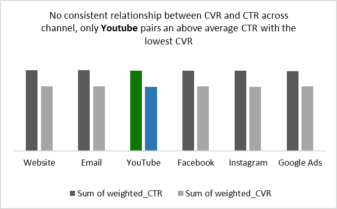
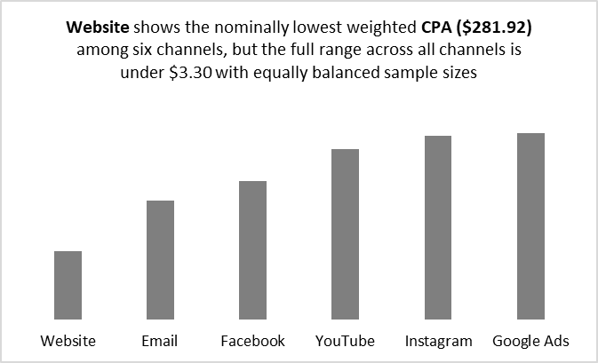
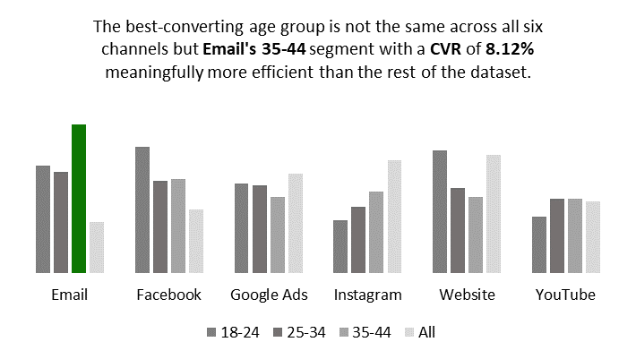
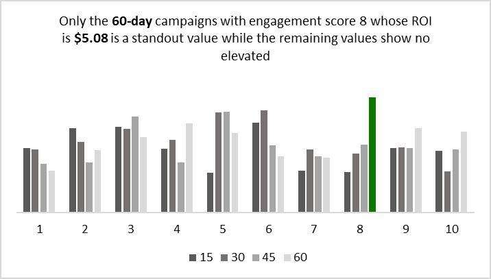
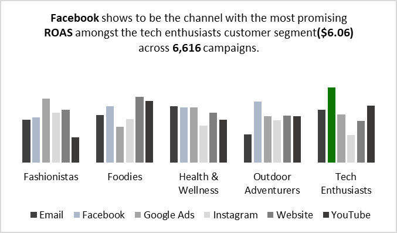
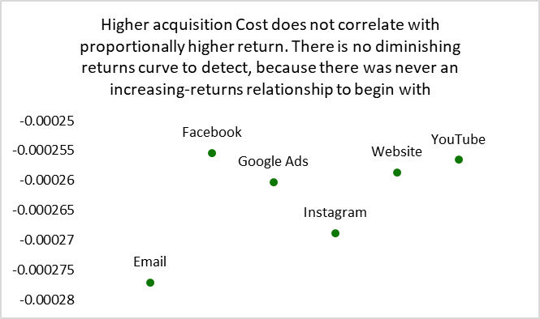
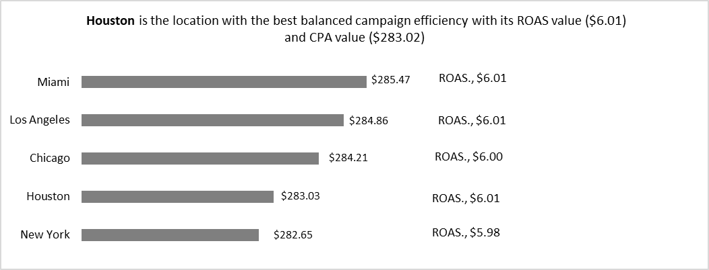
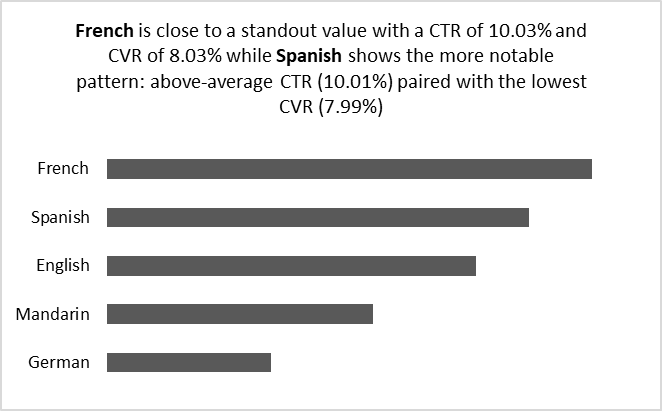

## Marketing Campaign Performance & ROI

## Business problem: 
A marketing team is running campaigns across multiple paid channels, but leadership does not know which campaigns are truly profitable and which are wasting budget. The current decisions are based on traffic volume rather than financial efficiency. In this project, you will act as the marketing analyst responsible for evaluating campaign performance by calculating key KPIs such as CTR, conversion rate, CPA, ROAS, and ROI. Your task is to identify which channels generate efficient returns, which ones underperform, and how budget should be redistributed. The goal is to deliver a clear data-backed recommendation on where to scale, optimize, or cut spend to maximize marketing profitability

## [Dataset](https://www.kaggle.com/datasets/manishabhatt22/marketing-campaign-performance-dataset)

## Business questions: 
1. Which channel has the highest CTR, and does high CTR co-occur with high CVR, or is it click-rich/conversion-poor?

2. Which channel has the lowest CPA?
3. Which Customer segment converts most efficiently and does that ranking change depending on channel?
4. Does campaign Duration correlate with ROI or engagement?
5. Which specific Channel × Segment combination produces the highest ROAS, and does it have sufficient customer base to be trusted?
6. Within each channel, does higher Acquisition Cost per campaign correlate with proportionally higher return, or do returns flatten past a certain spend level?
7. At what spend threshold, if any, does marginal ROAS drop below 1 (breakeven)?
8. Does Location affect campaign efficiency?
9. Does Language affect click behavior?

## North-Star Metrics:
- **CTR(Click through rate):** This measures the percentage of people who see the campaign and click on it .It is calculated as **SUM(clicks)/SUM(Impressions)**

- **CVR(Conversion rate):** This calculates the percentage of users who complete a specific desired action out of the total number of people who saw the campaign. It is calculated as **SUM(conversions)/SUM(clicks)**
- **CPA(Cost per acquisition):** This calculates how much the business spends per each new customer. This is calculated as **SUM(Acquistion_cost)/SUM(Conversions)**
- **Revenue:** This is the total amount earned by the business through its marketing campaign. This is calculated as **(Acquisition_cost * (1+ ROI))**
- **ROI(Return on Investment):** This measures the money the business spends on marketing campaigns against the revenue those campaigns generate.It is calculated as **SUM(Revenue-Acquisition_Cost) / SUM(Acquisition_Cost)**
- **ROAS(Return On Ad Spend):** This measures how much revenue the business makes per dollar spent on advertising.It is calculated as **SUM(Revenue)/SUM(Acquisition_cost)**

| Metrics | Value |
|-----------------|-------|
| Cost per acquisition(CPA) | $284.04 |
| Return On Ad Spend(ROAS) | $6.01 |
| Click Through Rate(CTR) | 9.98% |
| Conversion Rate(CVR) | 8.01% |
| Return On Investment(ROI) | 5.01%|

## Findings:
- **Which channel has the highest CTR, and does high CTR co-occur with high CVR, or is it click-rich/conversion-poor:** **Website** shows the nominally highest **CTR (10.02%)** but this is not a statistically significant standout **(Z=1.03)**. **Google Ads** shows the lowest **CTR (9.91%, Z = -1.98)**, approaching but not crossing significance. No consistent relationship exists between CTR and CVR across channels. **YouTube** pairs an above-average CTR with the lowest **CVR (7.98% ,Z=-1.57)**, the closest pattern to click-rich/conversion-poor in this data, but it does not make for a genuine finding. Overall, click-through rate and conversion performance are not meaningfully differentiated across channels

- **Which channel has the lowest CPA, and is this stable?:** **Website** shows the nominally lowest **CPA ($281.92)** among six channels, but the full range across all channels is under $3.30, with equally balanced sample sizes (33,000 per channel). This spread is well within the range expected from sampling noise rather than genuine channel differentiation, and **ROAS** is similarly flat with values between **$5.99 and $6.03** across all six channels.

- **Which Customer_Segment converts most efficiently, and does that ranking change depending on channel:**  Segment conversion efficiency does depend on channel which shows the best-converting age group is not the same across all six channels. **Email's 35-44 segment with a CVR (8.12%)** meaningfully more efficient than the rest of the dataset. Conversions(CVR) was not compared as a value alone; it was paired with Cost-Per-Acquisition(CPA) of each customers group who are **18-24,25-34,35-44 and all ages**. Findings show that **CVR** ranged from **7.94% to 8.12%** while **CPA** is between **$281.84 and $287.37**. The **18-24** age group has its highest **CPA** of **$287.37** from **Google Ads** while the most efficient **CVR** of this age group came from **Facebook(8.08%)**. Campaigns targeting **25-34 group** has its **CPA** going as high as **$285.85** which is for **Instagram** campaigns while the most efficient **CVR** for this age-group came from **Email(8.03%)**.  Campaigns for all age group has its highest CPA to be from **Youtube($286.40)** while the best **CVR** here is from **Website** at **8.06%**.

- **Does campaign Duration correlate with ROI or engagement:** This is to know if spend efficiency is time-decaying. **Engagement Score** which is synonymous to ratings in the instance of this dataset is rated from 1 to 10 while **campaign durations** are capped at **15,30,45 and 60 days**.
Correlation coefficient values between **campaign duration and ROI** amounts to **0.0011** which is a **weak correlation coefficient** while the correlation coefficient values between **campaign duration and engagement score** is **-0.003** which is a **very weak correlation coefficient**. Only one ROI seems to stand out in this instance which is **60-day campaign** with engagement score of **8** whose ROI is **$5.08** while the remaining values show no elevated ROI. The correlation coefficients confirm there is not significant time-delay or time-growth effect in spend efficiency. Campaign duration is not a meaningful level for ROI optimization in this dataset

- **Which specific Channel × Segment combination produces the highest ROAS, and does it have sufficient sample size to be trusted:** Facebook shows to be the channel with the most promising ROAS amongst the tech enthusiasts customer segment **($6.06)** across **6,616** campaigns. This suggests Facebook's smaller audience is disproportionately effective when targeting Tech Enthusiasts specifically indicating a concrete, trustworthy scaling opportunity.

- **Within each channel, does higher Acquisition_Cost per campaign correlate with proportionally higher return, or do returns flatten past a certain spend level:** Higher Acquisition_Cost does not correlate with proportionally higher return. Spend and conversion are statistically independent across every channel as there is no diminishing-returns curve to detect, because there was never an increasing-returns relationship to begin with. This holds consistently across all six channels with a correlation range between **-0.000255 to -0.000277**, reinforcing the pattern of no meaningful differentiation found throughout this project.

- **At what spend threshold, if any, does marginal ROAS drop below 1 (breakeven):** No spend threshold exists within this dataset where marginal ROAS drops toward or below 1.0 (breakeven). Across all 10 spend bins (ranging from ~$115K to ~$385K total spend), marginal ROAS remains stable between 5.86 and 6.32 with no declining trend as spend increases. This is following a consistent pattern with the near-zero correlation found between Acquisition_Cost and Conversions, and with the flat channel-level and segment-level ROAS/CPA figures found throughout this analysis. This dataset provides no evidence of a spend ceiling where budget can be increased without observed loss of efficiency at any point tested. 

- **Does Location affect campaign efficiency:**  Location doesn't affect campaign efficiency as there is no standout value amongst the variables.Campaigns were made across 5 different locations. Nominally and as displayed across this dataset all this while, a flat and similar values were shown across board but statistics has helped to put a third eye to the numbers. **Houston** is the location with the best balanced campaign efficiency with its **ROAS value ($6.01,Z= 0.74)** and **CPA value ($283.02,Z=-0.94)** while the closest to a standout is **New York**, with the **lowest CPA** in the dataset **($282.65, Z=-1.30)** paired with the **weakest ROAS ($5.98,Z=-1.90)** which is short of significance.

- **Does Language affect click behavior:** CTR & CVR are used to proxy click behavior in this instance. CTR ranges at a scale between 9.93% and 10.01% while CVR ranges from 7.99% and 8.03%. French is closest to a standout value with a **CTR(10.03%,Z=1.26)** and **CVR(8.03%,Z=1.65)** while **Spanish** shows the more notable pattern being an **above-average CTR (10.01%, Z=0.70)** paired with the **lowest CVR (7.99%, Z=-1.06)** which shows a click-rich, conversion-poor pattern. Overall, Language shows no meaningful effect on click-through or conversion behavior.

## Recommendation:
- **Increase spending directed at Facebook's tech enthusiast:** This is the only channel and segment combination that is directly under utilised rather than saturated.

- **Investigate outside the dataset for the real constraint on return:** Pricing, post-conversion constraints like checkout issues might explain variance in business outcomes than any other measureable variables here leading to a less $6 ROAS

- **Campaign duration should remain the same:** Correlation scores between campaign duration and engagement scores has no effect on ROI.

- **Prioritize the 35-44 age segment in the Email channel:** No other channel-segment combination is more efficient than this group

- **No evidence supports reallocating budgets away from channel, language or location:** North-star metrics such as CPA,ROAS, CVR and CTR shows no statistical significant variation across all six channels. Budget cutting or deprioritizing any channel is not supported by this data.

## Limitation
- Neither the dataset nor business question defines what "conversion" represent limiting how each dollar should be interpreted
- The flatness nature found across every tested dimension indicates a synthetic dataset that doesn't represent a dataset synonymous to a real business operations. Findings in this project should be treated as being illusive of the methodology instead of imitation of a real business.